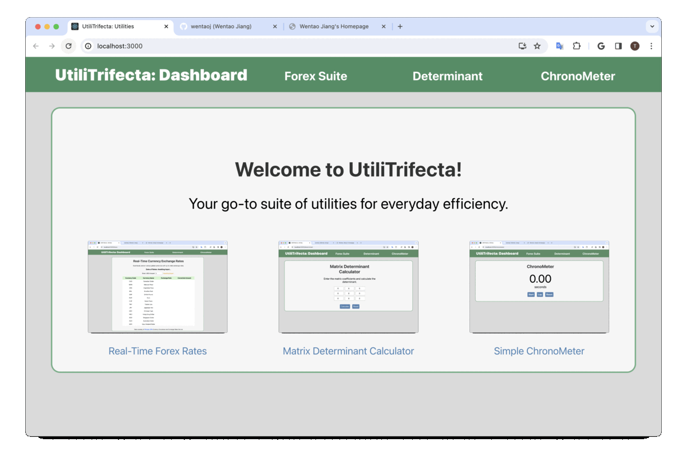
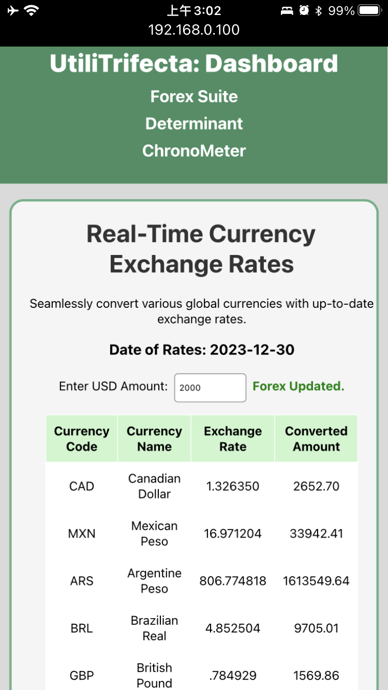
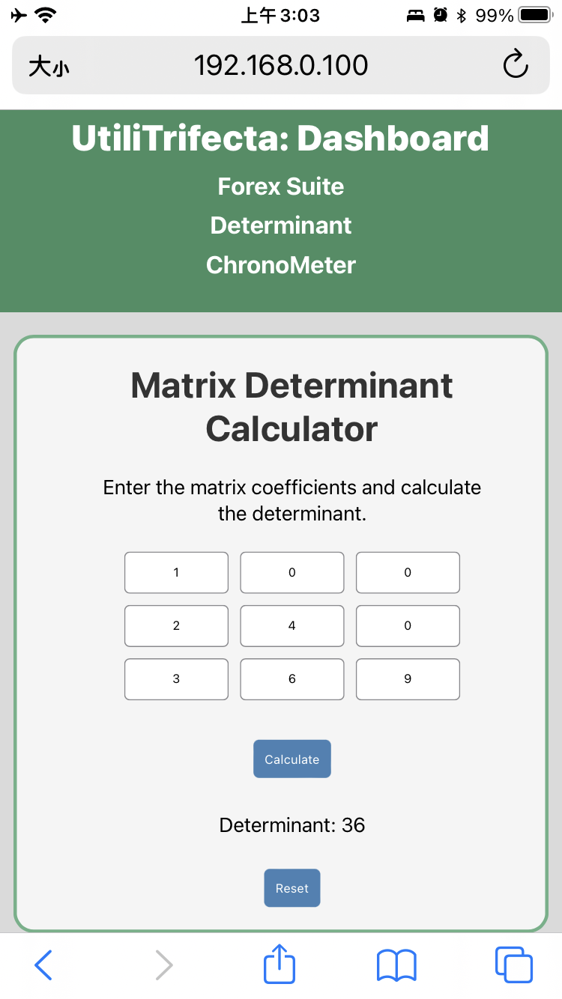
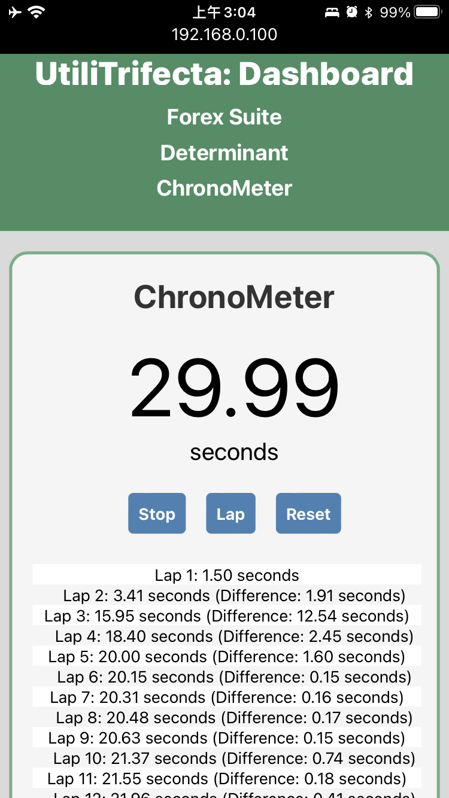

# [UtiliTrifecta]((https://wentaoj.github.io/UtiliTrifecta/)): A Trio of Practical React.js Utilities


## Project Information
#### Author: Wentao Jiang
#### Release Date: Apr.15, 2023
_Last Edit: Dec.31, 2023_

## Project Overview
**"UtiliTrifecta"** is a dynamic React.js Web Application designed and deployed on-site to boost daily productivity with easy-to-use tools. The application encompasses the following key features:

- **Forex Suites**: Real-time currency exchange rates from USD to various global currencies. [View Forex Suite](https://wentaoj.github.io/UtiliTrifecta/forex) / [View Source Code](./src/components/forex/forex.js)
- **Matrix Determinant Calculator**: Calculate the determinant of a matrix efficiently. [View Determinant Calculator](https://wentaoj.github.io/UtiliTrifecta/determinant) / [View Source Code](./src/components/determinant/determinant.js)
- **ChronoMeter**: A versatile stopwatch for timing and recording intervals. [View ChronoMeter](https://wentaoj.github.io/UtiliTrifecta/chronometer) / [View Source Code](./src/components/chronometer/chronometer.js)

## Screenshots and Demo
#### Deployment Website: [**`UtiliTrifecta`**](https://wentaoj.github.io/UtiliTrifecta/)
Explore **UtiliTrifecta**'s interfaces and features on [Github Pages deployment](https://wentaoj.github.io/UtiliTrifecta/). 

#### Desktop View:


#### Mobile View:
<div style="display: grid; grid-template-columns: repeat(3, 1fr); gap: 20px; max-width: 100%;">
  
  
  
</div>

## Development Environment
- **Deployment Environment**: macOS Sonoma 14.2.1 (23C71) on Apple M2
- **Development Tools**: npm 10.2.5, Node.js v21.4.0
- **React.js Version**: 18.2.0
- **Key Dependencies**: react, axios, gh-pages (full list in [`package.json`](./package.json))
- **Test Devices**: Tested on 13-inch MacBook Air (M2) and iPhone 8, with optimizations for small screens.

## Installation Instructions
#### Access via GitHub Pages (Recommended):
For immediate use without installation, access **"UtiliTrifecta"** on [Github Pages deployment](https://wentaoj.github.io/UtiliTrifecta/).

#### Local Deployment:
To run the application locally:
1. Clone this repository to your local machine.
2. Check your current npm version with `npm --version`. If not installed, download it from [npm](https://docs.npmjs.com/downloading-and-installing-node-js-and-npm).
3. Navigate to the project directory and install required dependencies with `npm install`.
4. Start the app with `npm start`. *If issues arise on macOS, see the troubleshooting section below.*
5. The app will be served at [`localhost:3000`](http://localhost:3000/).

##### Troubleshooting:
If permission errors occur, modify `node_modules` permissions:
```bash
# under the project directory
$ chmod -R 777 node_modules
# then run the app again
$ npm start
```

## Copyright Info
- **API Query Usage**:
  - *Currency Conversion and Exchange Rates*, developed and maintained by [Principal APIs](https://rapidapi.com/principalapis/api/currency-conversion-and-exchange-rates).
- **App Genre**: 
  - Utility
- **Application Developed by**:
  - &copy; 2023 [**Wentao Jiang**](https://wentaoj.github.io)
- **License**:
  - This project is licensed under the [MIT License](./LICENSE). Full license text is available in the repository.
- **Acknowledgments**: 
  - Special thanks to the developers and maintainers of React.js, Node.js, npm, axios, and other tools and libraries listed in [package.json](./package.json).

## Appendix
### Project Directory Structure:
```bash
.
├── LICENSE
├── README.md
├── demo
│   ├── UtiliTrifecta.gif
│   ├── chronometer@Mobile.png
│   ├── determinant@Mobile.png
│   └── forex@Mobile.png
├── package-lock.json
├── package.json
├── public
│   ├── favicon.ico
│   ├── index.html
│   ├── logo192.png
│   ├── logo512.png
│   ├── manifest.json
│   └── robots.txt
└── src
    ├── App.css
    ├── App.js
    ├── Nav.css
    ├── Nav.js
    ├── components
    │   ├── Layout.js
    │   ├── chronometer
    │   │   ├── chronometer.css
    │   │   └── chronometer.js
    │   ├── determinant
    │   │   ├── determinant.css
    │   │   └── determinant.js
    │   ├── forex
    │   │   ├── forex.css
    │   │   └── forex.js
    │   └── home
    │       ├── home.css
    │       └── home.js
    ├── images
    │   ├── chronometer.gif
    │   ├── determinant.gif
    │   └── forex.gif
    ├── index.css
    ├── index.js
    ├── logo.svg
    └── utils
        ├── App.test.js
        ├── reportWebVitals.js
        └── setupTests.js

11 directories, 36 files
# Directory listing excludes './node_modules' and './build'
```
<br>
&copy; 2023. Wentao (Todd) Jiang
